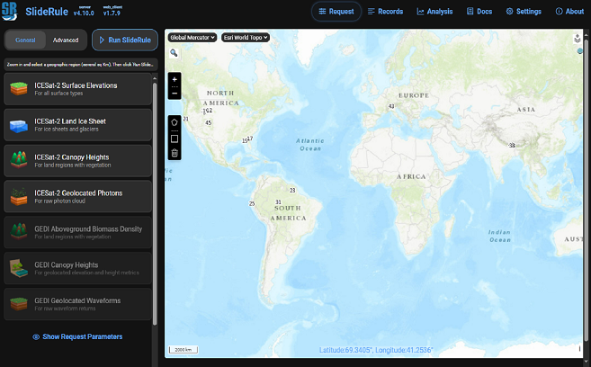
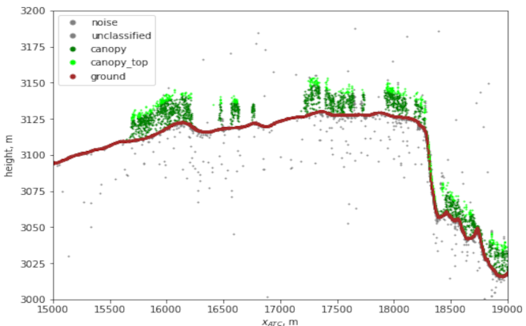
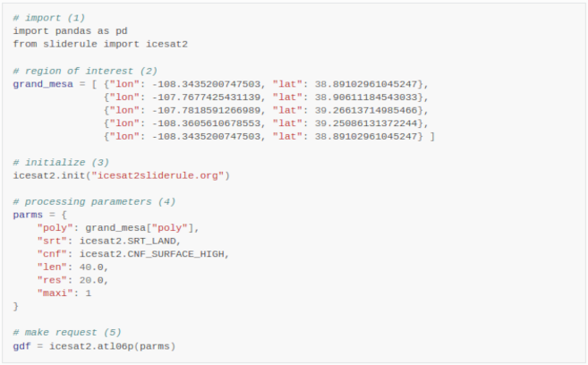

% ${VERSION} is replaced with clients/python/version.txt by "make documentation-prep"
# SlideRule ${VERSION}

**Process Earth science datasets in the cloud through API calls to SlideRule web services.**

- **GitHub**: <https://github.com/SlideRuleEarth/sliderule>
- **Documentation**: <https://docs.slideruleearth.io/>
- **Web Client**: <https://client.slideruleearth.io/>
- **PyPi**: <https://pypi.org/project/sliderule/>
- **Conda**: <https://anaconda.org/conda-forge/sliderule>
- **Node.js**: <https://www.npmjs.com/package/@sliderule/sliderule>

## Purpose of this Site

This documentation is intended to explain how to use `SlideRule` and its accompanying Python client. SlideRule is a web service for on-demand science data processing, which provides researchers and other Earth science data systems low-latency access to customized data products using processing parameters supplied at the time of the request. SlideRule runs in AWS us-west-2 and has access to ICESat-2, GEDI, Landsat, ArcticDEM, REMA, and a growing list of other datasets stored in S3.

While `SlideRule` can be accessed by any http client (e.g. curl) by making GET and POST requests to the `SlideRule` service,
the python packages in this repository provide higher level access to SlideRule by hiding the GET and POST requests inside python function
calls that accept basic python variable types (e.g. dictionaries, lists, numbers), and returns GeoDataFrames.

"Using SlideRule" typically means running a Python script you've developed to analyze Earth science data, and in that script calling functions in the **sliderule** Python package to make processing requests to SlideRule web services to perform some of the data intensive parts of your analysis.  Most of the documentation and examples we provide are focused on this use-case.  We do provide other means of interacting with SlideRule, most notably the web client at <https://client.slideruleearth.io>, both those aspects of the project are less documented.

## Where To Begin

::::{grid} 1 1 3 3

:::{card} Web Client
:link: https://client.slideruleearth.io

Try out an interactive web client.
:::

:::{card} Examples
:link: getting_started/Examples.md

Jump right in and learn from examples.
:::

:::{card} Getting Started
:link: getting_started/Install.md

Walkthrough what SlideRule can do.
:::

::::

## Contacting Us

SlideRule is openly developed on GitHub at <https://github.com/SlideRuleEarth>.  We welcome all feedback and contributions!  To reach us directly, feel free to email us at support@mail.slideruleearth.io

## Project Information

The SlideRule project is funded by NASA's ICESat-2 program and is led by the University of Washington in collaboration with NASA Goddard Space Flight Center.  The first public release of SlideRule occurred in April 2021.  Since then we've continued to add new services, new algorithms, and new datasets, while also making improvements to our processing architecture.  Looking to the future, we hope to make SlideRule an indispensable component in the analysis of a broad array of Earth Science datasets that help us better understand the planet we call home.
