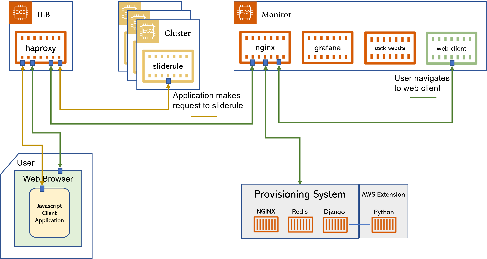

# SlideRule Web Client

## Use Cases

#### #1 - Advanced user

A researcher at the University of Washington, who is intimately familiar with the way the ATL06 algorithm works and the way it has been implemented in SlideRule, wants to explore the effect of different processing parameters over a particularly tricky area of interest.  This exploration will support a currently funded research effort to produce a new science data product.

They upload a shapefile describing their area of interest, which is the immediately outlined on the global map.  They then click through a series of options provided to them on the website to construct the exact processing request they want, hit the "run" button, and wait while SlideRule executes the request.  After a short time the results are displayed on the map inside the outlined area of interest.  They zoom, pan, and take a closer look at those results, utlimately deciding to use the web client to then plot a classified and filtered photon cloud for one of the tracks they have selected on the screen.

#### #2 - Scientist peripherally familiar with SlideRule

A researcher at the University of Maryland, who heard about SlideRule from a presentation at a conference, quickly looks up the url on their laptop and wants to explore what SlideRule is capable of doing.  They click through a few options, draw a quick polygon around their home city, hit the "run" button and quickly see some data come back to them displayed on the screen.

#### #3 - High school student

A student at Roosevelt High School wants to create a vegetation density graphic for a part of the Amazon Rain Forest that they are studying for their end-of-quarter research project.   They spend an afternoon figuring out how to use SlideRule to create an impressive looking plot that shows the deforestation of the Amazon over time.

## High Level Design Description

The SlideRule Web Client is a javascript application that runs in a user's browser after navigating to the the web client's URL.  The web client provides a map-based graphical user interface for making processing requests to SlideRule, and displaying and keeping track of the results returned from SlideRule.

The web client runs in a docker container inside a provisioned SlideRule cluster.  It is reached through the Intelligent Load Balancer (haproxy), and athentication proxy (NGINX), provided by the cluster.

A typical workflow for a user interacting with the web client is:
(1) An area of interest is drawn on the map
(2) An processing request type (i.e. API or endpoint) is selected, along with any associated parameters
(3) The "Run SlideRule" button is clicked and a progress indication is given to the user
(4) The results of the processing run are displayed onto the map; the user interacts with the map to analyze the data
(5) The user selects a data point on the map and uses it to prepopulate an additional request to an along-track API for that data
(6) The user finishes populating the along-track request and clicks "Run SlideRule" again; they are immediately taken to another view where there see both the previous run, and this current run which is in progress
(7) When the current run completes, they see a scatter plot of the along-track data, zooming in and out to get a better understanding of it.
(8) The user then uses the request record for the previous run to show that plot of the data again on a map view, they select a different ground track, but this time instead of using it to populate the parameters for an along-track request, they just directly plot the data into a scatter plot.
(9) The user then starts plotting diffrent columns in the returned data set in that scatter plot to get a better understanding of the data.
(10) Once satisfied, the user saves all of the data from the original processing run into a GeoParquet file on their computer; they do the same thing for the along-track processing run.
(11) The user exits all browser tabs running the client, and the client clears all records and memory within the browser associated with what the user did. 

The client will have four main views:
1. A ***beginner*** view - a simple map interface that is intuitive and allows users to quickly access basic features of SlideRule

2. An ***advanced*** view - a feature rich map interface with all of the processing request parameters exposed to the user for advanced SlideRule requests

3. A ***record*** view - a list of recent SlideRule requests along with the results available to replot and interrogate

4. A ***analysis*** view - a map plot of geospatial data or a scatter plot of along track data associated with one of the SlideRule processing requests

## Implementation Considerations

The software should be designed with a modern web framework: Vue.js, AngularJS, React, etc.

The Software should use a robust geospatial library for map functions: OpenLayers, Leaflet, Mapbox, etc.

## Requirements

> **Users** - individuals running the SlideRule Web Client in their browser
>
> **UI** - the user interface taken as a whole, without specifying a particular component
>
> **Map** - the user interface component showing a gobal map
>
> **Profile** - the user interface component showing an along track scatter plot the data
>
> **Records** - the user interface component showing the list of processing runs issued by the user in the current application session
>
> **SlideRule Service** - the cluster of computers running in AWS that execute processing requests

### 1. Application

#### SRWC-1.0: Execution Environment

The javascript application that makes the processing request to SlideRule and handles the returned data shall run in the user's browser on their computer.

#### SRWC-1.1: Browser Compatibility

The client application shall run on Chrome, Firefox, and Safari.

#### SRWC-1.2: Persistence

When a user executes the client in their browser, no matter how many tabs they have open with the client running, there should only be a single execution environment for the application.  In other words, opening a new tab in the browser to display some other UI element of the application should have the same view as if that UI element was opened in the current tabl.  Once all tabs running the client have been closed, all data associated with the client should be deleted from memory.

### 2. Plotting

#### SRWC-2.0: Result Map Plotting

The returned data from a SlideRule processing request that returns geolocated data shall be plotted onto the map.

#### SRWC-2.1: Result Profile Plotting

The returned data from a SlideRule processing request that returns along-track data shall be plotted onto a scatter plot.

#### SRWC-2.2: Map Plot Point

The geolocated column plotted onto the map shall be selectable from a drop-down list of all available columns; the client will maintain a list of default columns to use for each endpoint which is initially displayed.

#### SRWC-2.3: Map Plot Differencing

A difference between two columns in the returned data can be plotted onto the map.

#### SRWC-2.4: Profile Axis

(1) The X-Axis of the profile plot shall user selectable between either distance or time; the default is time.
(2) The Y-Axis of the profile plot shall be selectable from a drop-down list of all available columns; the client will maintain a list of default columns to use for each endpoint which is initially displayed.

#### SRWC-2.5: Plot Performance

The performance goal for the client is to plot 10M points onto the map and profile in less than 5 seconds.

#### SRWC-2.6: Area of Interest Selection

(1) The user shall be able to draw a *polygon* on the map to define their area of interest
(2) The user shall be able to draw a *bounding box* on the map to define their area of interest
(3) The user shall be able to upload a *shapefile* on the map to define their area of interest
(4) The user shall be able to upload a *geojson* on the map to define their area of interest
(5) The user shall be able to type/paste a *geojson* string into an input box to define their area of interest

#### SRWC-2.7: Area of Interest Manipulation

The user shall be able to add and remove multiple areas of interest

#### SRWC-2.8: Basemaps

The map shall support displaying multiple basemaps, to include:
* 3DEP
* ASTER GDEM
* ESRI Imagery
* GLIMS
* RGI

#### SRWC-2.9: Projections

The map shall support being displayed in three map projections: north polar, south polar, and plate carree.

#### SRWC-2.10: Map and Profile Manipulation

The map and the profile shall be able to pan and zoom via buttons and mouse jestures.

#### SRWC-2.11: Color Map

The data plotted onto the map and profile shall support a user selectable color map.

#### SRWC-2.12: Map Legend

When data is plotted, a map legend shall be displayed that includes all labels and color mappings.

#### SRWC-2.13: Hover Popup

When a user hovers over plotted points, a pop up information panel that provides result-specific data values associated with the plotted point (i.e. latitude, longitude, height, reference ground track, etc.) shall appear.

## 3. Workflow

#### SRWC-3.0: Basic and Advanced Mode

The UI shall include a control panel, left of the plotting space, that supports a **basic** mode and an **advanced mode**.  The basic mode is for beginner users, while the advanced mode is for advanced users.

#### SRWC-3.1: Request Records

The UI shall maintain a set of results and request parameters for the processing runs that have occurred since the browser has been opened and navigated to the client URL.  These "saved" processing runs will be referred to as **request records** and are presented to the user in the records view.  The data for the record should be readily available to the client for performant retrieval and analysis.

#### SRWC-3.2: Basic Mode

In basic mode, the control panel shall display the following controls: 
(1) A selection-type button for each supported API, to select which SlideRule request to make
(2) A "Run SlideRule" button that executes the request
(3) A "Manage Runs" button that navigates the user to the **request records** UI management view
(4) A "Clear All Runs" button that deletes all runs from memory and resets the display 

#### SRWC-3.3: Advanced Mode

In advanced mode, the control panel shall display the following controls
(1) All control elements present in basic mode
(2) Resource query parameter controls specific to the API that has been selected that allow a user to make a processing request without an area of interest
(3) A list of parameter controls specific to the API that has been selected; the parameter controls are grouped into exandable category sets (e.g. there might be a "Photon Classification" category with a expansion carrot next to it that once expanded displays a list of selection boxes for each of the photon classifiers supported by SlideRule)
(4) A list of selection controls for the different raster datasets that can be sampled as a part of the current processing request.
(5) A list of sampling parameter controls used to sample the selected rasters; only displayed once at least one raster is selected for sampling
(6) S3 output parameter controls to support the user requesting that the output be written to an S3 bucket' to include their AWS S3 write credentials, S3 bucket, and output format information

#### SRWC-3.4: Request Validation

When a user clicks the "Run SlideRule" button, prior to the request being sent to the SlideRule service, the parameters of the request shall be heuristically validated, with three possible outcomes:
(1) the request is valid and immediately passed to the SlideRule service
(2) the request is valid but contains suspicious settings; a pop up prompt is presented to the user with the concerns, and the user is allowed to cancel the request or continue on to make the request; a "do not show again" selection button is also presented to the user with this pop up.
(3) the request is invalid; a pop up is presented to the user stating the reason that the request is invalid, and no request is sent to the SlideRule service

#### SRWC-3.5: Run SlideRule

When a processing request is sent to the SlideRule service, a request record is created and made available in the records view.  The records view should show that the processing request is in progress until it is complete.

#### SRWC-3.6: Result Display

When the results of a processing request are returned to the client, those results should immediately be displayed on the map view if applicable.  In other words, if the request parameters are such that the data is streamed back to the client as it becomes available (e.g. the GeoParquet option is NOT selected), then the map should display the data points immediately upon receipt and not wait for the entire processing request to finish before displaying the data points.

#### SRWC-3.7: Concurrent Requests

When a processing request is sent to the SlideRule service while another processing request is in progress, the first processing request should continue in the background with its data displayed on the map being cleared; the data for the superceding second processing request should then take over the map display with any returned data from it being displayed on the map.

#### SRWC-3.7: Records View Plot Display

In the records view, when a user selects a request record, a plot of that record is displayed with the control panel showing the plot controls (e.g. the color map, the column selections, the axis selections, etc).  For geospatial results, this will be a map plot; for along track results this will be a profile plot.

#### SRWC-3.8: Automatic Porfile Plot Display

If a user makes a processing request that does not contain any geospatial data to be plotted on the map view, then the UI shall automatically transition to the records view and show the processing request record.

#### SRWC-3.9: Ground Track Selection

When a user selects a data point in the map view, if that data point is a part of a ground track, then entire ground track shall be highlighted (in addition to the hover information for the data point being displayed).  With the ground track highlighted, the user shall be presented a set of options:
(1) use ground track to prepopulate the appropriate track-based processing request (e.g. an ATL03 subsetting request) - this takes the user to the advanced mode control panel with the corresponding parameters populated for them
(2) plot the ground track directly - this takes the user to the records view for the processing request and displayed the profile plot for the seleted ground track

## 4. User Assistance

#### SRWC-4.0: Progress Indication

The UI shall provide a processing progress indication for all requests made to SlideRule.  This should be a progress bar just above the map view that shows a percentage complete based on the number of granules processed vs the total number of granules in the request.

#### SRWC-4.1: Memory Usage

The UI shall provide a current total memory usage in GB of the client on the local machine; in additional the amount of memory each request is contributing shall also be provided.

#### SRWC-4.2: Cluster Load

The UI shall provide the current load of the target SlideRule cluster as a percentage, updated every 30 seconds.

#### SRWC-4.3: Tutorial

The UI shall provide a tutorial that guides a user through a series of steps necessary to make a basic SlideRule request and interact with the data.

## 5. APIs and Parameters

#### SRWC-5.0: APIs

The following APIs shall be supported:
(1) `atl03sp`
(2) `atl06sp`
(3) `atl06p`
(4) `atl08sp` - future
(5) `atl08p`
(6) `atl024sp` - future
(7) `atl024p` - future
(8) `gedi04ap`
(9) `gedi02ap`
(10) `gedi01bp`
(11) `samples`
(12) `subsets`

#### SRWC-5.1: Raster Sampling

The following raster datasets shall be supported for sampling:
(1) GEDI L3 gridded ground elevation
(2) GEDI L3 gridded canopy height
(3) GEDI L3 gridded ground elevation-standard deviation
(4) GEDI L3 gridded canopy heigh-standard deviation
(5) GEDI L3 gridded counts of valid laser footprints
(6) MERIT Digital Elevation Model
(7) Simulated SWOT Data
(8) Simulated SWOT Data
(9) USGS 3DEP 1m Digital Elevation Model
(10) Worldwide land cover mapping
(11) Harmonized LandSat Sentinal-2
(12) PGC Arctic Digital Elevation Model Mosaic
(13) PGC Arctic Digital Elevation Model Strips
(14) PGC Reference Elevation Model of Antarctica Mosaic
(15) PGC Reference Elevation Model of Antarctica Strips

#### SRWC-5.2: Request Parameters

All request parameters supported by SlideRule for a given request shall be supported by the web client.
