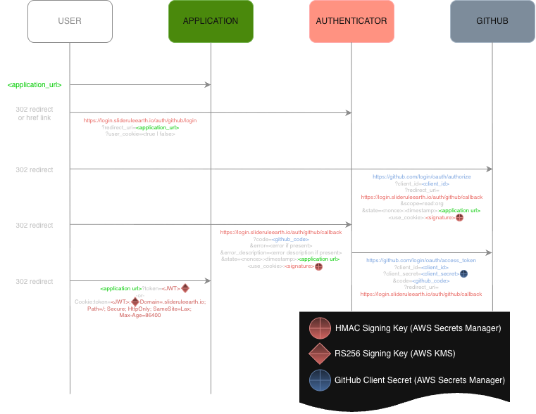

# 2026-03-12: Security Model

:::{note}
With release v5.2.0, SlideRule has overhauled and tighted its security model to prevent misuse of its public services.
:::

### Overview

SlideRule Earth leverages GitHub authentication and account membership status within the GitHub _SlideRuleEarth_ organization to authorize access to SlideRule services.  Credentials are provided by users using a JSON Web Token (JWT) issued by the SlideRule Earth login service (`login.slideruleearth.io`).  A user's JWT contains claims used and verified by SlideRule services to allow access.

### Model Components

#### Roles

* ***Owner*** - SlideRuleEarth owner with administrator access to all services
* ***Member*** - SlideRuleEarth member with nominal access to all services
* ***Collaborator*** - External affliate of the SlideRuleEarth team with access to designated services
* ***Guest*** - Authenticated user with access to public services
* ***Anonymous*** - Unauthenticated

#### Services

* ***Certbot*** - manages SSL certificates for the service domain.
* ***Authenticator*** at [https://login.slideruleearth.io](https://login.slideruleearth.io) – delegates authentication to an external identity provider (IdP), and performs authorization based on the authenticated identity.
* ***Provisioner*** at [https://provisioner.slideruleearth.io](https://provisioner.slideruleearth.io) – manages cluster lifecycle operations, including deployment, status, and tear-down
* ***Cluster*** at [https://{cluster}.slideruleearth.io](https://sliderule.slideruleearth.io) - provides low-latency science data processing (the primary application under the SlideRuleEarth project)
* ***Runner*** at [https://runner.slideruleearth.io](https://runner.slideruleearth.io) – provides batch job processing orchestration and status

#### Requests

* ***Unauthenticated Requests*** - No credentials are supplied in the HTTP request
* ***Authenticated Requests*** - Bearer token provided in authorization header of HTTP request
    - Users must use one of the authorization flows provided at `login.slideruleearth.io` to obtain a JWT
    - The JWT must be provided as a bearer token in each request to a SlideRule service: `Authorization: Bearer <JWT>`
* ***Signed Requests*** - EdDSA signature provided in custom SlideRule header of HTTP request
    - Users must create an Ed25519 public/private key pair and store in a well-known file in their home directory: `ssh-keygen -t ed25519 -f .sliderule_key`.
    - The public key `.sliderule_key.pub` must be provided to the SlideRuleEarth development team
    - Each request must be signed using the `.sliderule_key` private key.
    - The `signature` is calculated over the canonical message `{path_b64}:{timestamp}:{body_b64}` where `path_b64` is the base64 encoded string of the full path to the endpoint including the hostname of the service (e.g. provisioner.slideruleearth.io/info), `timestamp` is the unix system time expressed as seconds since epoch rounded to the nearest integer, and `body_64` is the base64 encoded string of the body of the request.
    - The ASCII encoded string of the `timestamp` is provided in the `x-sliderule-timestamp: {timestamp_str}` header, and the base64 encoded string of the `signature` is provided in the `x-sliderule-signature: {signature_b64}` header.

#### Permissions

* ***sliderule:access*** - nominal access to cluster services
* ***sliderule:admin*** - administrative access to cluster services
* ***provisioner:access*** - access to provisioner services
* ***runner:access*** - access to runner services
* ***mcp:tools*** - access to mcp server
* ***mcp:resources*** - access to mcp server

#### Authorization Flows

| Flow | Endpoints | Allowed Highest Roles | Allowed Permissions | Notes |
|:----:|:---------:|:-------------:|:-------------------:|:-----:|
| OAuth2.1 Web | /auth/github/register, /auth/github/login, /auth/github/callback, /auth/github/token | Owner | _all_ | preferred method for web applications |
| Device | /auth/github/device, /auth/github/device/poll | Owner | sliderule:access, sliderule:admin, provisioner:access, runner:access | preferred method for python client |
| PAT Key | /auth/github/pat | Member | sliderule:access, provisioner:access, runner:access | used for CI/CD pipelines |
| Basic Web | /auth/github/basic/login | Member | sliderule:access | returns JWT via cookie |

### Security Rules

#### Expirations

At different stages of the authorization flows there are time limits imposed to reduce the risk of compromised credentials.

| Element | Time Limit | Notes |
|:-------:|:----------:|:-----:|
| SlideRule JWT | 12 hours ||
| OAuth2.1 Web Authorization Session | 12 hours | Once a client is dynamically registered it must complete all authorization requests within this time |
| OAuth2.1 Web Authorization Code | 2 minutes | Once a client receives an authorization code it has this long to exchange it for a token; after its first use the code is no longer valid |
| GitHub HTTP Requests | 15 seconds | All requests to GitHub APIs must complete promptly |
| GitHub Authentication Session | 1 minute | Once the SlideRule server initiates the authentication flow with GitHub it has this long to complete the authentication |
| Signed Request | 1 minute | All signatures on signed requests must be timestamped within this amount of time (+/-) of the signature verification |

#### Cluster Access

Members of the SlideRuleEarth organization have permission to deploy, access, and destroy private clusters namespaced to the organization _teams_ they belong to.  Owners within the organization can deploy, access, and destroy any cluster with a valid namespace (obeying url rules and AWS cloud formation stack name restrictions).  Both members and owners are restricted to node capacity and time-to-live constraints imposed by the the *provisioner*.

| Role | Max Node Capacity | Max TTL |
|:----:|:-----------------:|:-------:|
| Owner | 100 | 1 year |
| Member | 50 | 12 hours |

#### Web Client Restrictions

When logging into SlideRule using the SlideRule Web Client, the client restricts the user permission set to `sliderule:access`, and `provisioner:access`.  This prevents a leaked token from being used for administrator access or for access to any of the other services

#### Third Party Redirects

When a third party application is granted access to SlideRule services, a reduced set of permissions are enforced.  Any authorization attempt that requests permissions not in the reduced set will be rejected.  Currently, the only allowed permissions for third party applications are: `mcp:tools`, `mcp:resources`.

#### MCP Exclusivity

When MCP resources are requested (either via the `scope` or `resource` field of the authorization request), all permissions that would have been granted in the JWT are dropped and only the `mcp:tools` and `mcp:resources` permissions are provided.  This is to limit third party agents from broad access to SlideRule resources.

#### Request Signing

The following services require request signing:
* All requests to the ***Provisioner*** when the user provides a JWT that identifies them as an Owner.
* All requests to the ***Runer*** regardless of the role of the user.
* Requests to the ***Cluster*** (public or private) that route to the Arbitrary Code Execution (`ace`) and Container Runtime Environment Execution (`execre`) endpoints.

### Flow Diagrams

#### Basic Web Flow (OAuth 2.0 Authorization Code)

