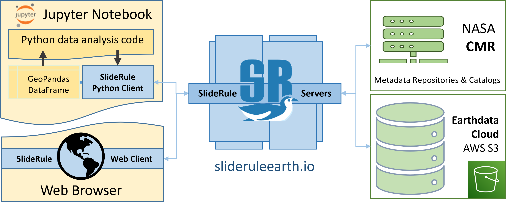

===========
Project Map
===========

THe SlideRule Earth project has a lot of moving parts and it can be difficult for new users to know where to find the code and documentation they need.
This document will provide a high level overview of the different components of SlideRule and their associated code repositories and documentation trees.

Component Organization
------------------------------------

.

:Jupyter Notebook: Jupyter Notebook|Lab|Hub is the expected analysis environment of researchers that want to incorporate SlideRule into their work.  That doesn't mean SlideRule can't be used with other environments - it can; it works with any system that can issue HTTP requests and process HTTP responses.  But the SlideRule project provides a Python client that makes it much easier to work with SlideRule, and on top of that, we've provided Python routines and examples that are designed to run in a Python Jupyter environment.

    .

:Python Client: The SlideRule Python client is a set Python modules that provide functions for making processing requests to SlideRule web services.  In a Jupter environment, all interactions with SlideRule occur through the Python client.  For researchers that want to use SlideRule, the Python client is likely the only part of the SlideRule system they need to know.

    .

:Web Client: The SlideRule Web Client is a single-page application distributed by AWS CloudFront that runs inside a user's browser.  Most of the functionality provided by the SlideRule Python Client is provided in the Web Client as a graphical interface.  Additionally, the Web Client provides visualization and client-side exploration of the data via an SQL interface and graphing components.

    .

:CMR: SlideRule leverages NASA's Common Metadata Repository (CMR) for querying which dataset resources (i.e. granules) need to be processed for a given processing request.  When analysis scripts call SlideRule's Python client functions and pass in time ranges and polygons that define geospatial regions, those functions typically will issue a request to CMR behind the scenes, passing through those parameters, to get a list of granules that match the criteria.

    .

:Cluster: The heart of the SlideRule system is a cluster of EC2 instances in AWS us-west-2 running Docker containers of SlideRule's server-side code.  Earth science researchers do not need to know anything about how the server-side code works in order to use SlideRule.  But for developers who are interested in how the server side works, SlideRule is a framework implemented in C++/Lua consisting of a core multithreaded data processing system, and extension packages that include things like the HTTP web server, the HDF5 data access library, and the mission specific algorithms.

    .

:Earthdata Cloud: For datasets used by SlideRule, authentication and access are taken care of automatically without the user needing to provide credentials.  Each dataset also has dedicated code on the SlideRule servers that handle resource querying and optimized data access.

Links to Project Resources
------------------------------------

    Web Client: `client.slideruleearth.io <https://client.slideruleearth.io>`_

    Python Client Installation Instructions: `Getting Started Guide <../getting_started/Install.html>`_

    Python Client User's Guide: `SlideRule Reference Documentation <../api_reference/sliderule.html>`_

    Python Client Examples: `sliderule/clients/python/examples <https://github.com/SlideRuleEarth/sliderule/blob/main/sliderule/clients/python/examples>`_

    Juypter Notebook Widgets: `ipysliderule.py <https://github.com/SlideRuleEarth/sliderule/blob/main/sliderule/clients/python/sliderule/ipysliderule.py>`_

    SlideRule Server Source Code: `SlideRule GitHub <https://github.com/SlideRuleEarth/sliderule>`_

    SlideRule Web Client Source Code: `SlideRule Web Client GitHub <https://github.com/SlideRuleEarth/sliderule-web-client>`_

Repository Organization
--------------------------------------

All of the software for SlideRule is open source under the BSD 3-clause license and developed in the open on GitHub. Users and future contributors are encouraged to browse the code, fork the repositories and submit pull requests, open issues, and post discussion topics.

The SlideRule project consists of two main repositories.

  * The `sliderule <https://github.com/SlideRuleEarth/sliderule>`_ repository includes all source code for the deployment of sliderule

    - `server <https://github.com/SlideRuleEarth/sliderule/tree/main/packages>`_: mission agnostic C++/Lua framework for processing science data

    - `datasets <https://github.com/SlideRuleEarth/sliderule/tree/main/datasets>`_: mission specific data subsetting and processing algorithms

    - `python client <https://github.com/SlideRuleEarth/sliderule/tree/main/clients/python>`_: the Python client code that allows users to easily interact with SlideRule from the Python language

    - `documentation <https://github.com/SlideRuleEarth/sliderule/tree/main/docs>`_: source for our static website and user documentation

    - `infrastructure <https://github.com/SlideRuleEarth/sliderule/tree/main/targets/slideruleearth>`_: infrastructure code which contains the scripts and definition files for deploying the SlideRule system to the AWS cloud

  * The `sliderule-web-client <https://github.com/SlideRuleEarth/sliderule-web-client>`_ repository containing the source code for the SlideRule Web Client; written in JavaScript
