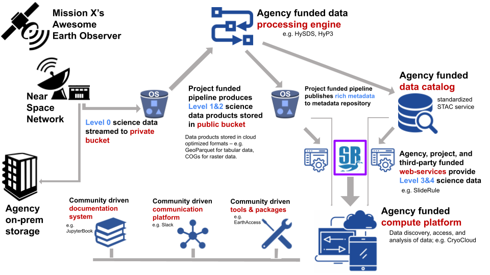

==============
Why SlideRule
==============

What Is SlideRule?
##################

SlideRule is a server-side framework implemented in C++/Lua that provides APIs for processing science data and returning results in real-time. SlideRule can be used by researchers and other data systems for low-latency access to customized data products that are generated using processing parameters supplied at the time of the request.

The development of SlideRule is led by the University of Washington in conjunction with NASA’s ICESat-2 program. The University of Washington is currently running a public instantiation of SlideRule in AWS us-west-2, accessible at https://slideruleearth.io.  This deployment supports science investigations using  the ICESat-2, GEDI, REMA, ArcticDEM, HLS, 3DEP, and a growing list of other datasets.

Where does SlideRule fit?
###########################

SlideRule is not trying to be the end-all solution for science data processing.  If the ultimate goal is producing actionable scientific information, SlideRule plays a small but important part in the ecosystem of tools and processes needed to get there.  Frustration with SlideRule can be the result of misunderstanding where we fit in and wanting SlideRule to perform tasks that should be met by other systems.  Conversely, the need for SlideRule is best understood in the light of how it fits in with the overall Earth data system and the specific roles we a fulfilling.

The diagram below attempts to capture an opinionated realization of what a public Earth data system should look like and how SlideRule fits in.  It is **not** a diagram of how things are; nor does it represent the policy of any institution involved in the development of SlideRule.  Instead it represents the architecture the SlideRule team is advocating for and building towards.

As seen below, the role SlideRule plays in this overall Earth data system is providing web-services for the generation and distribution of level 3 and level 4 science data products.

    Proposed Earth Data System

The SlideRule development team advocates for the following characteristics in any future Earth data system:

* Level 0 science data should be streamed directly from ground stations to project-managed **private S3 buckets**.

* An agency funded **data processing engine** should be leveraged by projects to run project-funded pipelines that produce level 1 and level 2 science data products.

* Level 1 and level 2 science data products should be hosted in **public S3 buckets** in **cloud-optimized formats**.

* **Rich metadata** should be automatically generated for all science data products according to community standards and posted to an agency-funded metadata service that supports standardized access.

* Agency, project, and third-party funded **web-services** should provide level 3 and level 4 science data products on demand using the publicly available level 1 and level 2 data along with the publicly accessible metadata services.

* An agency-funded **compute platform** should be provided to researchers for ease of access, data discoverability, modest compute needs, and community building.

* Community driven **documentation, communication, and tooling** should be promoted as a primary goal for all missions and explicitly supported by projects.

Why Develop SlideRule?
######################

Our goal is to model a fundamental change in the way Earth science data is distributed by institutions and interacted with by data users.  Current approaches to science data access center around data archives.  Institutions pre-generate datasets which are archived and made available via data centers.  Data users download parts of those datasets from the data centers and perform local processing and analysis.  SlideRule models an approach that is centered around services.  Institutions make science data available via web services, and data users integrate those web services directly into their existing data analysis systems.

Another way to explain this shift is to see that the historical approach to science data distribution revolved around files.  Science data product files were generated by large processing pipelines and stored in large data centers to be downloaded by users.  In the historical approach, users accessed science data products through files - files that they had to download, manage, store, organize, and understand.  The approach moduled by SlideRule removes the file from the picture; similar to the way we interact with services like Google Maps or weather apps, we interact with the SlideRule services without ever having to download or worry about a file.  Client side applications issue web service requests to servers running services, and immediately get back the data in memory in a format understood by the the client application.

The tremendous growth in the size of Earth science datasets being produced by institutions over the past ten to fifteen years has broken the historical data archive model. When datasets changed from being a few hundred Gigabytes to hundreds of Terabytes (and now Petabytes), comprehensive analysis of those datasets using existing technology became impossible.  For example, ICESat (the original mission), launched in 2003 and in its lifetime produced 148GB of global elevation data. That data could be downloaded at 6MBps in just under 1 day, and stored on a single hard drive on a single workstation. ICESat-2 (the follow-on mission), launched in 2018 and has produced 320TB of data as of 2021, with 100TB of data being added each year. In order to download the existing dataset at 100MBps, it would take 296 days, and require 40 workstations with 8TBs of storage each to hold.

Performing comprehensive analysis on current Earth science datasets requires sophisticated compute and storage infrastructure, and high bandwidth connectivity to the data sources; both of which are insurmountable barriers of entry to all but the most funded institutions.

The interim solution to this problem currently offered by most missions is the pre-generation and distribution of higher level data products which target specific science applications.  By targeting a narrow application these data products are smaller and therefore easier to download and work with.  The problem with this interim solution is that these applications need to be selected ahead of time and naturally limit what can be done with the data.  Unforeseen applications, and even small modifications to those applications cannot be handled.  Science discovery requires the exploration of new relationships in data.  By pre-selecting and hard-coding which relationships can be analyzed, the use of pre-generated higher level data products greatly limit what can be done with the datasets our missions produce.

Moving to a service model for data distribution addresses all of these problems.  Institutions which produce datasets distribute those datasets through services by building out (on-premise or in the cloud) the infrastructure needed to store and process the data, and making all of it directly accessible by data users.

:L1 & L2 Generation: Lower-level datasets are still produced via pipelines developed and maintained by the institution.
:L1 & L2 Distribution: Instead of being made available for download only, the lower-level data is stored in cloud-based object stores and data users are given direct access to the datasets when they run locally in the data center.
:L3 & L4 Generation: Higher-level products are not generated via pipelines, but are provided through services.  Institutions take the same investment they would make in developing the algorithms for higher-level product generation, and instead of hard-coding all the parameters that go into a processing run and statically producing and archiving the resulting files, they expose those algorithms as services and let users supply the processing parameters they need for their specific science application.
:L3 & L4 Distribution: Data users can access the higher-level products not just from inside the data center, but from anywhere, including their local infrastructure.

A service model for data distribution has many benefits:

1. **Users choose the science application, not the institution**

Instead of data users downloading pre-generated data products, data users make processing requests to the data service and receive back customized data products tailored to their science application based on the parameters they supplied in their request.

2. **Compute requirements are no longer a barrier to data access**

Instead of data users needing to set up their own distributed storage system and processgin cluster in order to run basic data analysis, the sophisticated compute and storage infrastructure needed to manage and process the lower level data is provided by the institution, freeing up the data user to focus on their scientific investigation.

3. **New algorithms can be added at any time**

Instead of institutions running multiple pipelines to produce data products that are released on fixed schedules, institutions run multiple services and new services can be added at any time and have access to all of the data (current and historic) immediately.

4. **Improvements and fixes are immediately available**

Instead of institutions having to replace old versions of data products when processing improvements and fixes are made, and then requiring data users to redownload those data products, institutions deploy improvements and fixes to their services and it immediately becomes available to data users.

5. **Multiple science applications benefit from a single investment**

By parameterizing algorithms, the resources spent developing an algorithm can serve  different science applications.

6. **Services integrate with other services**

When institutions move to a service-based model for data distribution, those services can be integrated into other systems and produce synergetic benefits.  A data archive stands alone, and the only way to avoid duplicating efforts between different archives is to combine and centralize the functionality.  On the other hand, a data service can be integrated with and leverage other data services while still remaining decentralized.  For example, one university could build a data service that leverages the public API of another university’s data service to produce a combined data product without ever having to rehost the other university’s data.  From a technical implementation standpoint, the two universities remain distinct and decentralized entities, yet by providing their data as a service, they allow for combined data products.

What are SlideRule’s Goals?
###########################

In developing SlideRule, the team has six goals we believe are necessary to successfully demonstrate a viable service-based data distribution approach.

1. **Cost Effective**

The system must have near zero costs when not in use, and be able to scale in a cost-controlled way when demand increases.  If there is a recurring cost to support each service, then there is a disincentive to provide more services.  By designing a system that scales to zero when there is no demand, the development of different processing algorithms can be done without the burden of having to support large recurring costs once it is deployed.

Scaling costs to zero also protects against funding gaps and allows smaller institutions to use the system when funded by grants and awards, and not lose all that they’ve invested when that funding runs out.

2. **Responsive Results**

If results can be returned fast enough, the user can interact with the data in ways that are impossible in batch processing systems where they have to wait hours (or even days) to get their results.  Data analysis is often iterative, and a system that supports iterative exploration of the data and customization of the algorithms that process the data, supports the users in the way they want to work with the data.

Also, keeping latencies low allows the system to integrate with other systems with low latency requirements.  For instance, systems that provide situational awareness cannot wait hours to get a response.  If a data service takes hours to respond to a processing request, it disqualifies itself from being able to be integrated with those types of systems.

3. **Simple API**

Learning a new system incurs a real and possibly large upfront cost.  If we are building a system that is attempting to lower the cost burden of data users and relieve them of the need to make investments in their compute and storage infrastructure, we cannot then require large investments of time and personnel to be able to use our system.  That would be merely shifting the costs and creating a different barrier to entry.

4. **Expandable**

There are two ways in which a data service needs to be expandable to support new science applications: (1) the addition of new science processing algorithms, (2) the addition of new datasets.  In both cases, the data service needs to add the new functionality without increasing the overall complexity of the system and without introducing risk or regressions in the current set of available services.

5. **Scalable**

As demand increases, the system needs to scale to meet the demand. And the way the system scales needs to match the objectives and charter of the institution funding the service.  For instance, a private university may want to allow privileged access to compute resources for its own members, whereas a government agency may want to allow equal access to all available compute resources for any of its citizens. For a data service framework to be successful in the different situations it will be used in, it must be flexible enough to support the different ways its service can scale.

6. **Open**

The shift away from static files to using real-time data services must not sacrifice the ability for independent review of the processes that produced the results and the ability to reproduce those results.  The former is greatly aided by open sourcing the software; the later is supported by robust configuration management processes.
