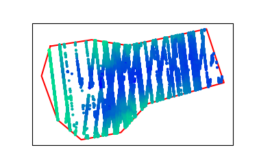

# Making Your First Request

2021-04-22

## Overview

This tutorial walks you through the steps necessary to make your first request to SlideRule. By the end of this tutorial you will have used SlideRule to caclulate and plot elevations over Grand Mesa, Colorado, using ICESat-2 photon cloud data.

**Prerequisites**: This walk-through assumes you are comfortable using `git` and the `conda` Python packaging system. See the [installation](../../getting_started/Install.html) instructions in the reference documentation for details on other methods of installation.

## Background

While it is possible to directly access all of ICESat-2 SlideRule's services using any client that communicates over HTTP, it is more practical to use the supplied [Python client](https://github.com/ICESat2-SlideRule/sliderule-python), which hides much of the complexity of interacting with each of the services and provides a high-level Python interface for most use-cases.

For this reason, _"using"_ SlideRule is, in practice, the same as writing a Python script that uses the SlideRule-Python client package.  The Python client is used to issue science processing requests to `slideruleearth.io` and then analyze the responses that come back.

These processing requests will typically specify a geospatial region of interest (e.g. defined by a GeoJSON file) and instruct the SlideRule system what algorithms it wants to have run on the ICESat-2 data collected within that region.  When SlideRule receives the request, it reads the appropriate source datasets, executes the requested algorithms on that data, and returns the results back to the requesting application.

## Setting Up Your System

__Step 1__: Clone the Python client repository
```bash
$ git clone https://github.com/ICESat2-SlideRule/sliderule-python.git
```

__Step 2__: Create a conda environment with all the necessary dependencies
```bash
$ cd sliderule-python
$ conda env create -f environment.yml
```

__Step 3__: Activate the sliderule conda environment
```bash
$ conda activate sliderule
```

## Your First Processing Request

Now that you have an environment all setup and ready to use SlideRule, this section will walk you through a very simple example that calculates geolocated elevations in the Grand Mesa region in Colorado at a 20m along-track resolution.

__Step 1__: Import the SlideRule Python package for ICESat-2.
```python
>>> from sliderule import sliderule, icesat2
```

__Step 2__: Initialize the `icesat2` package .
```python
>>> icesat2.init("slideruleearth.io", verbose=False)
```
In general, it is only necessary to provide the _url_ to the `init` function; but for this example we are also turning on _verbose_ log messages so we can get more insight into what is happening.  For a full description of the options available when initializing the `icesat2` package, see the [init](../../api_reference/icesat2.html#init) documentation.

__Step 3__: Create a list of coordinates that represent the Grand Mesa region of interest.
```python
>>> grand_mesa = sliderule.toregion('grandmesa.geojson')
```
The **grandmesa.geojson** file used in this example can be downloaded by navigating to our [downloads](/rtd/tutorials/downloads.html) page; alternatively, you can create your own GeoJSON file at [geojson.io](https://geojson.io).

The `toregion` function creates a representation of the geospatial region that is understood by SlideRule.  It accepts both GeoJSON files and Shapefiles.  For a full description of the function, see the [toregion](../../user_guide/ICESat-2.html#toregion) documentation.

__Step 4__: Create a dictionary of processing parameters specifying how the elevations for the region should be calculated.
```python
>>> parms = {
    "poly": grand_mesa["poly"],
    "srt": icesat2.SRT_LAND,
    "cnf": icesat2.CNF_SURFACE_HIGH,
    "len": 40.0,
    "res": 20.0,
    "maxi": 1
}
```
For a full description of the different processing parameters that are accepted by SlideRule, see [parameters](../../user_guide/ICESat-2.html#parameters).  The parameters of interest here are _len_ which specifies the total along-track length of the segment used to calculate an elevation, and _res_ which specifies the along-track posting interval of the calculation.

__Step 5__: Issue the processing request to SlideRule.
```python
>>> rsps = icesat2.atl06p(parms)
```
When you hit enter, you should see a scrolling list of log messages saying "*atl06 processing initiated on...*". These messages are normal and expected (and displayed only because of the _verbose_ setting used when we initialized the `icesat2` package).

There are many valid reasons for some resources to return no elements, but most often it is because the resource was identified by NASA's CMR system as crossing the region of interest, yet when SlideRule processed the resource, it did not actually intersect.  This happens because the CMR system adds an off-pointing margin to all ground tracks when calculating intersections and therefore over estimates which resources cross any given region.

When this completes (~30 seconds), the _rsps_ variable should now contain all of the results of the elevations calculated by SlideRule.

__Step 6__: Analyze the results using Pandas.
```python
>>> rsps.describe()
                 lat  n_fit_photons            lon      dh_fit_dx  ...         h_mean     rms_misfit            rgt    segment_id
count  100277.000000  100277.000000  100277.000000  100277.000000  ...  100277.000000  100240.000000  100277.000000  100277.00000
mean       39.028478     132.139414    -108.030490      -0.001975  ...    2707.639564       2.512702     841.096513  500659.18788
std         0.082476     131.598809       0.121329       0.306945  ...     440.133777       3.124903     384.650923  284372.50888
min        38.827507       0.000000    -108.315698     -26.344217  ...    1396.383336       0.042654     211.000000  215376.00000
25%        38.969076      37.000000    -108.112334      -0.096951  ...    2371.550240       0.569138     737.000000  216597.00000
50%        39.034390      87.000000    -108.043394      -0.001515  ...    2846.206073       1.387819    1156.000000  217400.00000
75%        39.097182     166.000000    -107.936355       0.086064  ...    3068.137673       3.363937    1156.000000  785282.00000
max        39.194233    1767.000000    -107.735253      24.634544  ...    3737.048479     164.336963    1179.000000  786420.00000

[8 rows x 13 columns]
```
For a full description of all of the fields returned from the `atl06p` function, see the [elevations](../../user_guide/ICESat-2.html#elevations) documentation.

__Step 7__: Plot the geolocated elevations returned by SlideRule using measurements collected by ICESat-2 in the Grand Mesa region.
```python
>>> import matplotlib.pyplot as plt
>>> rsps.plot()
>>> plt.show()
```
The resulting plot should look something like:



## Next Steps

Once you've completed this walk-through and are comfortable issuing processing requests to SlideRule, you should take a look at the [Documentation](../../) and the example [Jupyter Notebooks](../../getting_started/Examples.html).

There is also a [Demo Application](https://demo.slideruleearth.io/) which renders a simple [widgets-based notebook](https://github.com/ICESat2-SlideRule/sliderule-python/blob/main/examples/voila_demo.ipynb) using *voila* that allows you to try different processing parameters and see the output on an interactive map.
