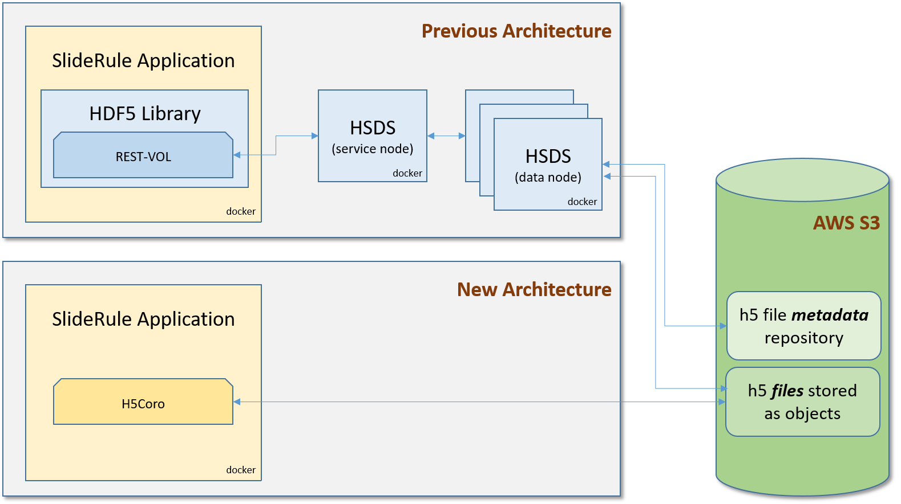
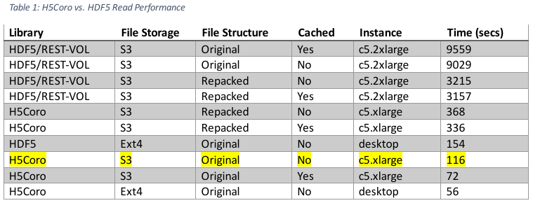

# H5Coro

2021-04-23

## Executive Summary

The HDF5 Cloud-Optimized Read-Only Library

NASA’s migration of science data products and services to AWS has sparked a debate on the best way to access science data stored in the cloud.  Given that a large portion of NASA’s science data is in the HDF5 format or one of its derivatives, a growing number of efforts are looking at ways to efficiently access H5 files residing in S3.  This article describes one of those efforts and argues for the creation of a standardized subset of the HDF5 specification targeting cloud environments.

The challenge of optimizing H5 file access in different environments is not new.  The HDF5 specification is large and flexible and supports many different data models for H5 files.  Applications can use H5 files like they were self-contained file systems. Or they can use H5 files in place of databases.  Or, as is the case with much of NASA’s science data, H5 files can be used as name-spaced annotated data stores. Yet, instead of having a small and efficient implementation of the HDF5 specification targeted for each of these different use-cases, they all use the same monolithic HDF5 library.

For example, at the start of this year, all of the following software systems on ICESat-2 used the same HDF5 library: (1) science product services running in AWS that access H5 data in S3, (2) Python scripts written by researchers that read H5 files stored locally, (3) the Fortran programs that generate the official ICESat-2 H5 data products that run on supercomputer clusters. For each of these applications, the historical approach has been to tune the use of the library for optimal performance in its environment.

But with the recent migration to cloud environments and their pay-for-only-what-you-use cost model, tuning efforts have fallen short of cost effectively taking advantage of the cloud.  By lifting current software systems and shifting them to the cloud, and then relying on application tuning to optimize them for their new environment, the move from on premise to cloud is costing more and providing less.

As different projects have been confronted with this reality, various efforts have started to address the challenge of efficiently accessing H5 data in cloud-base storage systems. These efforts include approaches like restructuring the data inside the H5 file, overlaying cloud-optimized indexes overtop the original H5 files, and reformatting the data into cloud-optimized formats.  All of these approaches revolve around either changing the data, or supplementing the data with additional tools and metadata.

This article recommends a different approach: ___change the library___.

Given that there is currently only a single implementation of the HDF5 format in use – the HDF5 library, it becomes the de facto standard, and the limitations of the library become the limitations of the format.  If the library performs poorly in a cloud environment, it is said that the format is not suited to the cloud environment.

But when the focus shifts from the library to the format specification, then there is a path forward for efficiently using HDF5 data in future NASA cloud-based data systems:

1. A small set of common data models for HDF5 cloud-based systems can be identified.

2. Optimized implementations of the HDF5 specification can be developed and supported for each of those common data models.

3. For each implementation, a subset of the HDF5 specification can be standardized, which the implementation is guaranteed to support.

4. The existing HDF5 library can continue to be used and supported everywhere it is currently used.  It becomes the reference implementation for the specification and the catchall utility for HDF5 tooling.

The HDF5 Cloud-Optimized Read-Only Library (H5Coro) is a first attempt at this new approach, undertaken by ICESat-2’s SlideRule project.  The H5Coro implementation is written in C++ and focuses on reading static time-series datasets from S3.  Its use on SlideRule removed critical performance barriers in accessing ICESat-2 datasets hosted in S3 and has enabled the project to cost effectively offer science processing services to the ICESat-2 science community.

The demonstrated benefits of using the H5Coro library in SlideRule show that the approach of changing the library and not the data has merit, and that future efforts to utilize NASA’s HDF5 datasets could greatly benefit from a standardized subset of the HDF5 specification specifically suited for cloud environments.

## SlideRule Project Background

The NASA/ICESat-2 program is investing in a collaboration between Goddard Space Flight Center and the University of Washington to develop a cloud-based on-demand science data processing system called SlideRule to lower the barrier of entry to using the ICESat-2 data for scientific discovery and integration into other data services.

SlideRule is a server-side framework implemented in C++/Lua that provides REST APIs for processing science data and returning results. This enables researchers and other data systems to have low-latency access to generated data products using processing parameters supplied at the time of the request.  SlideRule is able to communicate with back-end data services like HSDS as well as directly access H5 data stored in AWS S3 through its H5Coro library.  This combination provides cloud-optimized access to the ICESat-2 source datasets while preserving the existing HDF5-based tooling the project has already heavily invested in.

The initial target application for SlideRule is processing the ICESat-2 point-cloud and atmospheric datasets for seasonal snow depth mapping and glacier research.  We chose this application because there is a growing interest in these areas of research across both universities and government, and because no high-level ICESat-2 data products targeting these communities currently exist.

## SlideRule Project Goals

The ultimate goal of the SlideRule project is to enable researchers to investigate questions they were hitherto unable to ask by providing them a scalable and dynamic science data distribution service.  In the end, we hope SlideRule can be used as a model for future missions to change the way institutions release data products.

For us to be successful, our service needs to have five characteristics:

1. Cost effective

    Our system should have near zero costs when not in use, very small startup costs, and the ability to scale in a cost-controlled way to handle processing demand.

2. Responsive

    For interactive sessions, the results for typical regions of interest should be returned quickly enough that the user does not go off and do something else while waiting for them. For integrated services (other software systems using our system as a service), we should be able to handle many small requests efficiently with minimal latency.

3. Simple and well-documented

    The user interface for our system should be intuitive and require a very small learning curve.  The methods for accessing our service should match current trends and be available through common packaging systems (for example, Python users should be able to install pip and/or conda packages to use our system).

4. Able to easily integrate new datasets

    The architecture of SlideRule cannot be built around a single dataset or file format, but must be easily expandable to handle datasets from other science communities stored in their native formats.

5. Highly configurable

    We must strive to minimize the amount of recurring effort needed to target additional science use-cases.  Complimentary to that, the architecture must allow for the addition of new science processing capabilities without increasing the overall complexity and maintainability of the core software.

## Limitations of Initial Design

Our initial architecture for processing ICESat-2 data in S3 used the native HDF5 library with the REST-VOL connector to read datasets via HDF5’s Highly Scalable Data Service (HSDS). HSDS was run as a cluster of Docker containers on each EC2 instance we deployed to, and fanned out requests to S3 across multiple reader nodes. This provided a significant performance improvement over other approaches at the time, which included downloading the entire file or mounting the remote file for local access.

But the HSDS architecture still suffered from significant performance drawbacks, specifically:

* __All read calls into the HDF5 library are serialized__ inside the library due to a global API lock.  As a result, even though SlideRule issues many dataset read requests concurrently, and HSDS is capable of tremendous parallelism, the number of actual concurrent reads to S3 was limited to those associated with one dataset at a time.

* __HSDS issues multiple HTTP requests per H5 dataset chunk__ being read.  This means that the chunk size of the dataset is the single greatest factor in how performant the read is.  Datasets that consist of many small chunks explode the number of TCP/IP socket connections that are needed and the per-read latencies dominate overall performance.

* __A metadata repository is needed__ to hold pointers into the original H5 files which HSDS uses to know how to read the various datasets in the file.  This means that before any H5 file in S3 can be read by our system, it must first be loaded through an HSDS pipeline to build and store the metadata for it.  A typical region of interest consisting of 60 granules can take over 8 hours to load using a single c5.xlarge EC2 instance.

These drawbacks were impediments to having both a cost-effective and responsive system.  In order to achieve sub-one minute response times for typical processing requests, we estimated the need to instantiate anywhere from 50 to 150 c5.xlarge EC2 instances at a base cost of $400/day.

In addition to the costs, the complexity of the system was also categorically increasing.  Instead of managing a few EC2 instances running a couple of Docker containers via Docker-Compose or local scripts, we were looking at needing thousands of Docker containers, and with it sophisticated container orchestration software and observability systems.

Lastly, in order to use our system, we needed to build, maintain, and operate a data pipeline that read ICESat-2 data hosted by NASA, re-chunk it to optimize its chunk sizes for S3 access, upload it to our own S3 bucket, and then load it into HSDS to build and store the metadata HSDS needed.  With tooling we had at the time, we were able to fully load about 5GB of data per hour per EC2 instance.  Assuming ICESat-2 produces 150TB of data each year, this would require us to fully automate, maintain, and continuously run a pipeline consisting of four EC2 instances 365 days a year, just to keep up with the new data ICESat-2 produces; that doesn’t take into account historical data backlogs and re-releases due to version updates.

## The HDF5 Cloud-Optimized Read-Only Library (H5Coro)

H5Coro is a C++ module inside the SlideRule server that was written from scratch and implements an HDF5 reader for H5 files that reside on the local file system or in S3. Its purpose was to address the performance deficiencies in the existing HDF5 software identified above.

To that end, it has these key features:

* __All reads are concurrent.__  Multiple threads within the same application can issue read requests through H5Coro and those reads will get executed in parallel.

* __Intelligent range gets__ are used to read as many dataset chunks as possible in each read operation.  This drastically reduces the number of HTTP requests to S3 and means there is no longer a need to re-chunk the data (it actually works better on smaller chunk sizes due to the granularity of the request).

* __The system is serverless.__ H5Coro is linked into the running application and scales naturally as the application scales.  This reduces overall system complexity.

* __No metadata repository is needed.__  Instead of caching the contents of the datasets which are large and may or may not be read again, the library focuses on caching the structure of the file so that successive reads to other datasets in the same file will not have to re-read and re-build the directory structure of the file.

These key features come out of a design decision to focus on a narrow subset of HDF5’s capabilities specifically suited for reading data that is static (it never changes after it is written) and is stored in high-throughput, high-latency storage systems like S3.

Given that the ICESat-2 data is static inside the H5 files and that it was written by a software process that had all of the data available to it prior to the writing of the file, the library can make certain assumptions about how the data is organized and what parts of the HDF5 specification don’t need to be supported.  As a result, the implementation focuses on the most efficient way to retrieve the values of a dataset and nothing else.

Given that S3 has high-throughput and high-latency, the library strives to minimize the overall number of reads even when it comes at the cost of increasing the total amount of data read.  In addition, the implementation uses a simple heuristic for predicting which sections of the file contain the requested data.  It then attempts to read all of the requested data in as few read operations as possible.

## Where H5Coro Fits In

{: .align-center}

## Performance Comparisons

The tests below were run using a local (US east coast, home computer) Python script that made four concurrent processing requests to a single SlideRule instance running in AWS us-west-2.  The processing request was to calculate elevations for the Grand Mesa region and required a total of 66 granules to be read from S3.  HSDS was deployed on the same EC2 instance as SlideRule and consisted of a single service node and eight data nodes.

Some of the test runs were executed multiple times, while others were only executed once.  The two largest sources of variability were S3 performance and local file system caching.  Every attempt was made to limit variability in the data below, but the results should still only be considered a sampling of performance and not a predicted performance estimate.

{: .align-center}

The performance improvement gained by switching from the HDF5 library to the H5Coro library for reading the original dataset out of S3 is anywhere from a factor of 77 to 132 depending on which configurations are compared against each other.

It should also be noted that the H5Coro performance scales near linearly with the number of parallel requests being made.  Previous testing with scaling HSDS showed that increasing the number of data node containers by a factor of four only resulted in a factor of 1.6 improvement in performance.  Conversely, we were able to scale our H5Coro deployment by a factor of four and we saw a factor of 3.5 improvement in performance.

Lastly, the highlighted row represents the baseline performance of the H5Coro module and is the target for all future optimizations – specifically, the original H5 files stored in S3 and accessed without caching.   In this configuration, a deployment uses two processing nodes is able to process the Grand Mesa region in 25 seconds.

## Implementation Details

The H5Coro C++ API supports a two very similar functions:
| Function | Description |
|:--------------:|:---------:|
| ___read___ | read a dataset from an H5 file (blocking) |
| ___readp___   | read a dataset from an H5 file (non-blocking) |


#### H5Coro::read

```cpp
info_t H5Coro::read (const char* url,
                     const char* datasetname,
                     RecordObject::valType_t valtype,
                     long col,
                     long startrow,
                     long numrows,
                     context_t* context=NULL,
                     bool _meta_only)
```

url
:    the fully qualified path to the H5 file (i.e. s3:///mybucket/folder/myfile.h5)

datasetname
:    the full path to the name of the dataset within the H5 file

valtype
:    the data type of the data to be returned; the recommended type is DYNAMIC, which tells the library to return the data in the type it is stored as in the file

col
:    the column to be read from multi-dimensional datasets; in order to read from multiple columns, multiple reads are needed

startrow
:    the starting row in the dataset to read from

numrows
:    the number of rows in the dataset to read

context
:    an opaque handle to a context structure which holds cached information about the file so that future read operations do not have to re-read metadata portions of the file

_meta_only
:    a boolean indicating whether only the meta data for the dataset should be returned; subsequent reads of the dataset will not incur the same performance penalty as the meta data will be cached

info_t
:    a structure holding the contents of the data read from the H5 file along with useful metadata like the data type

The `H5Coro::read` call is thread-safe and concurrent, allowing any number of threads to issue H5 read requests in parallel.  Inside the function call, the library performs the following steps:

1. It opens the specified H5 file and begins reading at the superblock.

2. The internal structure of the file is traversed to arrive at the start of the data object associated with the requested dataset.

3. Prior to reading the dataset, all required data attributes like data type, dimensionality, and filters are read and stored.

4. Using the dimensionality and data type attributes of the dataset, a buffer is dynamically allocated to hold the contents of the data to be read.

5. Using the storage attributes of the dataset, the library guesses the start and stop addresses of the dataset contents being requested.  It then performs as few reads as possible to read all of the requested data, accounting for any mistakes in its initial guesses.

6. If the calling code has requested a data type conversion, the contents of the dataset are converted before being returned to the calling code; otherwise the contents are returned directly.

#### H5Coro::read

```cpp
H5Future* H5Coro::readp (const char* url,
                         const char* datasetname,
                         RecordObject::valType_t valtype,
                         long col,
                         long startrow,
                         long numrows,
                         context_t* context=NULL)
```

{parameters}
:    see **H5Coro::read** for parameter descriptions

H5Future*
:    a pointer to a structure that ___will___ contain the `info_t` information read from the H5 file when the read operation completes

The `H5Coro::readp` call is thread-safe, concurrent, and highly parallel.  It is non-blocking and publishes the read request to a read queue that is serviced by a compile-time configurable number of reader threads.  This is intended to provide the capability to read data in parallel for applications that are inherently limited in the number of threads they are able to run.  Once a read request is picked up by one of the reader threads, the process of reading the dataset is identical to the `H5Coro::read` function.

#### Caching

There are two levels of caches used by the library to speed up operations:

* A ___local file cache___ is used to store blocks of the H5 file being read.  A minimal cache line size is configured at compile time and works on the assumption that the fields being read from the internal structures of the H5 file are often near each other.  The local file cache is maintained in the context pointer optionally passed to the H5Coro::read call.  This allows applications which read multiple datasets from a single file to re-use the local file cache between those reads.  It is also important to note that dataset contents are not cached, this maximizes the available memory in the cache for file structure metadata.

* A ___global dataset cache___ is used to store the metadata information of a dataset.  Given there are only a few pieces of information needed in order to know how to read a dataset, the H5Coro library maintains a large set of the most recently read datasets.  If the dataset is requested again, the library does not need to re-traverse the H5 file structure in order to arrive at the necessary data object, but can skip directly to the step where the start and stop addresses of the data are guessed at and the data contents are read.

## Specification Coverage

The following portions of the HDF5 format specification are intentionally not implemented:
* All write operations
* File free space management
* File driver information
* Virtual datasets

The following portions of the HDF5 format specification are intentionally constrained:
* Datasets with dimensions greater than 2 are flattened to 2 dimensions and left to the user to index.
* Only sequentially stored data can be read at one time, hyperslabs are not supported.
* Data type conversions are only supported for fixed and floating point numbers, but the intended use of the library is to return a raw memory block with the data values written sequentially into it, allowing the user to cast the memory to the correct array type.

The following portions of the HDF5 format specification are either currently implemented or are under consideration to be implemented in future versions of the H5Coro library:

| Format Element | Supported | Contains | Missing |
|:--------------:|:---------:|:--------:|:-------:|
| ___Field Sizes___ | <span style="color:green">Yes</span> | 1, 2, 4, 8, bytes | |
| ___Superblock___   | <span style="color:blue">Partial</span> | Version 0 | Version 1, 2, 3 |
| ___B-Tree___  | <span style="color:blue">Partial</span> | Version 1 | Version 2 |
| ___Group Symbol Table___  | <span style="color:green">Yes</span> | Version 1 | |
| ___Local Heap___  | <span style="color:green">Yes</span> | Version 0 |
| ___Global Heap___  | <span style="color:red">No</span> | | Version 1 |
| ___Fractal Heap___ | <span style="color:green">Yes</span> | Version 0 | |
| ___Shared Object Header Message Table___ | <span style="color:red">No | | Version 0 |
| ___Data Object Headers___  | <span style="color:green">Yes</span> | Version 1, 2 | |
| ___Shared Message___  | <span style="color:red">No</span> | | Version 1 |
| ___NIL Message___  | <span style="color:green">Yes</span> | Unversioned | |
| ___Dataspace Message___  | <span style="color:green">Yes</span> | Version 1 | |
| ___Link Info Message___  | <span style="color:green">Yes</span> | Version 0 | |
| ___Datatype Message___  | <span style="color:blue">Partial</span> | Version 1 | Version 0, 2, 3 |
| ___Fill Value (Old) Message___  | <span style="color:red">No</span> | | Unversioned |
| ___Fill Value Message___  | <span style="color:blue">Partial</span> | Version 2 | Version 1, 3 |
| ___Link Message___  | <span style="color:green">Yes</span> | Version 1 |
| ___External Data Files Message___  | <span style="color:red">No</span> | | Version 1 |
| ___Data Layout Message___  | <span style="color:blue">Partial</span> | Version 3 | Version 1, 2 |
| ___Bogus Message___  | <span style="color:red">No</span> | | Unversioned |
| ___Group Info Message___  | <span style="color:red">No</span> | | Version 0 |
| ___Filter Pipeline Message___  | <span style="color:green">Yes</span> | Version 1 | |
| ___Attribute Message___  | <span style="color:blue">Partial</span> | Version 1 | Version 2, 3 |
| ___Object Comment Message___  | <span style="color:red">No</span> | | Unversioned |
| ___Object Modification Time (Old) Message___  | <span style="color:red">No</span> | | Unversioned |
| ___Shared Message Table Message___  | <span style="color:red">No</span> | | Version 0 |
| ___Object Header Continuation Message___  | <span style="color:green">Yes</span> | Version 1, 2 | |
| ___Symbol Table Message___  | <span style="color:green">Yes</span> | Unversioned | |
| ___Object Modification Time Message___  | <span style="color:red">No</span> | | Version 1 |
| ___B-Tree ‘K’ Value Message___  | <span style="color:red">No</span> | | Version 0 |
| ___Driver Info Message___  | <span style="color:red">No</span> | | Version 0 |
| ___Attribute Info Message___  | <span style="color:red">No</span> | | Version 0 |
| ___Object Reference Count Message___  | <span style="color:red">No</span> | | Version 0 |
| ___Compact Storage___  | <span style="color:green">Yes</span> | | |
| ___Continuous Storage___  | <span style="color:green">Yes</span> | | |
| ___Chunked Storage___  | <span style="color:green">Yes</span> | | |
| ___Fixed Point Type___  | <span style="color:green">Yes</span> | | |
| ___Floating Point Type___  | <span style="color:green">Yes</span> | | |
| ___Time Type___  | <span style="color:red">No</span> | | |
| ___String Type___  | <span style="color:green">Yes</span> | | |
| ___Bit Field Type___  | <span style="color:red">No</span> | | |
| ___Opaque Type___  | <span style="color:red">No</span> | | |
| ___Compound Type___  | <span style="color:red">No</span> | | |
| ___Reference Type___  | <span style="color:red">No</span> | | |
| ___Enumerated Type___  | <span style="color:red">No</span> | | |
| ___Variable Length Type___  | <span style="color:red">No</span> | | |
| ___Array Type___  | <span style="color:red">No</span> | | |
| ___Deflate Filter___  | <span style="color:green">Yes</span> | | |
| ___Shuffle Filter___  | <span style="color:green">Yes</span> | | |
| ___Fletcher32 Filter___  | <span style="color:red">No</span> | | |
| ___Szip Filter___  | <span style="color:red">No</span> | | |
| ___Nbit Filter___  | <span style="color:red">No</span> | | |
| ___Scale Offset Filter___  | <span style="color:red">No</span> | | |

## Design Limitations

The H5Coro library was written to optimize access to the ICESat-2 H5 datasets.  These datasets are typically numerical time-series which are chunked, compressed, and stored sequentially in memory.  This layout is exploited in order to quickly determine the start and stop location of the data to be read, and works well when subsetting ICESat-2 data.

The H5Coro library, as written, would not work well subsetting higher-dimensional image data.  Subsetting image data using a spatial region is likely to cause the requested data chunks to be located in non-sequential memory locations within the file.  Such a layout is not anticipated by the heuristics used inside H5Coro for constructing read requests to S3, and would result in non-optimal performance.

But, while the current implementation of H5Coro is poorly suited for such applications, the overall approach taken by the H5Coro still applies, and minor modifications to the internal heuristics used by H5Coro could produce drastic improvements in performance for image data.

Whether a library like H5Coro should be enhanced to support configurable heuristics for constructing read requests, or whether a different library should be written for the different use-case is a subject worthy of discussion.

## Conclusion

By implementing H5Coro on ICESat-2 SlideRule’s project, we were able to meet our immediate goals of providing a cost-effect and responsive data system for our customers; but we also believe our approach is applicable to other projects and demonstrates a path forward to successfully using HDF5 data in the cloud.

The dramatic improvement in performance of H5Coro over the existing HDF5 library shows that the original library was never designed to run in a cloud environment, and that changes to the data are not necessary in order to achieve performant data access.

As more HDF5 data is migrated to the cloud, we should invest in taking the necessary steps to allow small, narrowly focused implementations of the HDF5 specification to thrive.  These implementations will enable the massive investments already made to create these datasets to continue to provide value to the science community for years to come.

