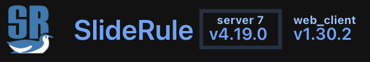

# Versioning

## Overview

The SlideRule version information is provided to the user to identify the exact configuration of the code used to produce a given set of results.  This configuration consists of the SlideRule [GitHub Repository](https://github.com/SlideRuleEarth), Docker containers stored in the AWS `Elastic Container Registry`, and AWS services provisioned through configuration managed Terraform scripts.

## Getting the Version

There are three primary ways to get the version of SlideRule:

#### Web API

Using any client able to speak HTTP, the `version` endpoint can be hit to retrieve the current version of SlideRule that is running.

For example:
```bash
$ curl -sS https://sliderule.slideruleearth.io/source/version | jq
```
has the following output:
```json
{
  "server": {
    "launch": "2025-09-02T06:05:11Z",
    "build": "v4.19.0-0-g79275b17, 6.1.147-172.266.amzn2023.aarch64, Thu Aug 28 19:04:14 UTC 2025",
    "duration": 645587997,
    "organization": "sliderule",
    "cluster": "sliderule-blue",
    "packages": [
      "core",
      "arrow",
      "aws",
      "cre",
      "geo",
      "h5",
      "streaming",
      "bathy",
      "bluetopo",
      "gebco",
      "gedi",
      "icesat2",
      "landsat",
      "opendata",
      "pgc",
      "swot",
      "usgs3dep",
      "gedtm",
      "nisar",
      "atl24"
    ],
    "version": "v4.19.0",
    "environment": "v4.19.0-0-g79275b17"
  }
}
```

#### Python Client

The [SlideRule Python Client](https://anaconda.org/conda-forge/sliderule) can be used to retrieve the version of SlideRule running in the cluster that the client has been configured to talk to (which by default is the public cluster).

```Python
from sliderule import sliderule
sliderule.get_version()
```

#### Web Client

The [SlideRule Web Client](https://client.slideruleearth.io) automatically retrieves the version of SlideRule running in the public cluster and displays it for the user in the upper left corner of the browser window.



## Understanding the Version

The versioning information provided by SlideRule characterizes multiple aspects of the SlideRule system.

#### Library Version (`version`)

The SlideRule executable version (called the Library Version in the code) is the semantic version used by the SlideRule team to identify a release of SlideRule.  It uses the following convention:
> vX.Y.Z

where:
* X is the major version; when incremented it indicates a break in backward compatibility.
* Y is the minor version; when incremented it indicates new or significatly changed functionality
* Z is the patch version; when incremented it indicates a bug fix with no changes in the intended functionality of the system

The SlideRule executable is packaged into a Docker container, tagged with the semantic version, which is built at the same time the library and executable is built. For all practical purposes, the building of the SlideRule executable and the building of the SlideRule Docker container image can be thought of as the same thing; the same code base and build information applies to both.  In other words, the Docker container image is the final output of, and method of packaging for, the SlideRule executable.

#### Build Information (`build`)

The build information is a string that indentifies the configuration of the SlideRule software build.  There are three pieces of information contained in the build information string, separated by commas:
* The git commit identifier of the code used to build the SlideRule library
* The operating system base image used to build the SlideRule library
* The wall-clock time when the SlideRule library was built

For example, the following build information has the following meaning:
```
v4.19.0-0-g79275b17, 6.1.147-172.266.amzn2023.aarch64, Thu Aug 28 19:04:14 UTC 2025"
```
* v4.19.0-0-g79275b17 - commit `79275b17` which occurred `0` commits after tag `v4.19.0`
* 6.1.147-172.266.amzn2023.aarch64 - Amazon Machine Linux 2023, build 6.1.147-172.266, running on ARM64
* Thu Aug 28 19:04:14 UTC 2025 - date and time when the library was built

#### Environment Information (`environment`)

When the SlideRule executable (Docker container) is deployed, it can be deployed on various target hardware and runtime environments. The environment information contains the git commit identifier of the code used to provision the AWS resources that created the runtime environment.

For example, if the environment information is `v4.19.0-0-g79275b17`, that means the terraform scripts used to provision the runtime environment came from the SlideRule git repository at commit `79275b17` which was `0` commits after tag `v4.19.0`.

## Client Version

In addition to the version information needed to identify the version of the SlideRule server executable running, SlideRule clients provide their own version information.

#### Python Client

To get the version of the SlideRule Python Client:
```Python
from sliderule import version
version.version
```

When the SlideRule Python Client `init()` function is called, it issues a `get_version()` request to the SlideRule cluster and then checks that the client version is compatible with the server version.  If there is a major version difference, the initialization function will return an error.  If there is a minor version difference, the initialization function will return a warning.

#### Web Client

The SlideRule Web Client identifies its version next to the server version in the upper left corner of the browser window.

## Note on Reproducibility

It is the goal of the SlideRule development team to create a system where results are able to be reproduced; but this is often times either extremely difficult or impossible for reasons outside of the teams control.
* SlideRule relies on publicly hosted datasets. When those datasets are updated, older versions of the datasets are often removed.  For instance, ICESat-2 Standard Data Products have a 6-month to 1-year release cycle and EarthData Cloud only stores the last two releases.
* Production systems must stay up-to-date with all security patches.  This means  libraries used by older versions of SlideRule may not be able to be deployed if newer versions of those libraries contain security patches.
* While we make every effort to keep backward compatibility for as long as possible, our development time is a limited resource and we are unable to maintain very old architectures of SlideRule.  Once we increment a major version number, we often remove deprecated functionality and internal configurations needed to deploy those older system designs.  That does not mean it would not be impossible to recreate the environment needed to run the older design - it does mean it becomes more and more impractical to do so.